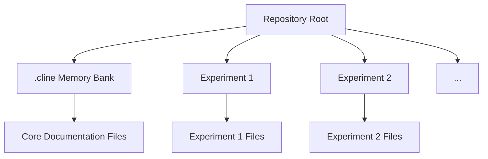

# System Patterns

## Current Architecture
As a playground repository, the current architecture is minimal and exploratory. The system is designed to be flexible and expandable as different experiments and demonstrations are added.

### Core Components
- **Memory Bank**: The `.cline/` directory containing documentation files
- **Playground Projects**: Various example projects may be added in subdirectories
- **Demo Applications**: Small applications may be created to demonstrate specific capabilities

## Key Technical Decisions
- **Repository Structure**: Organized to allow multiple independent examples/experiments
- **Documentation-First Approach**: Memory Bank documentation is prioritized over code
- **Experimental Freedom**: No strict conventions enforced to allow creativity and exploration

## Design Patterns in Use
- **Documentation Pattern**: Using the Memory Bank hierarchy to maintain context
- **Modular Experimentation**: Each experiment/demo can follow its own patterns independently
- **Incremental Complexity**: Examples can build upon each other to demonstrate progressively advanced capabilities

## Component Relationships

## Extensibility Points
- New experiments can be added as separate directories
- Memory Bank can be extended with additional context files as needed
- Custom workflows can be documented and tested
- Integration with various technologies can be demonstrated
