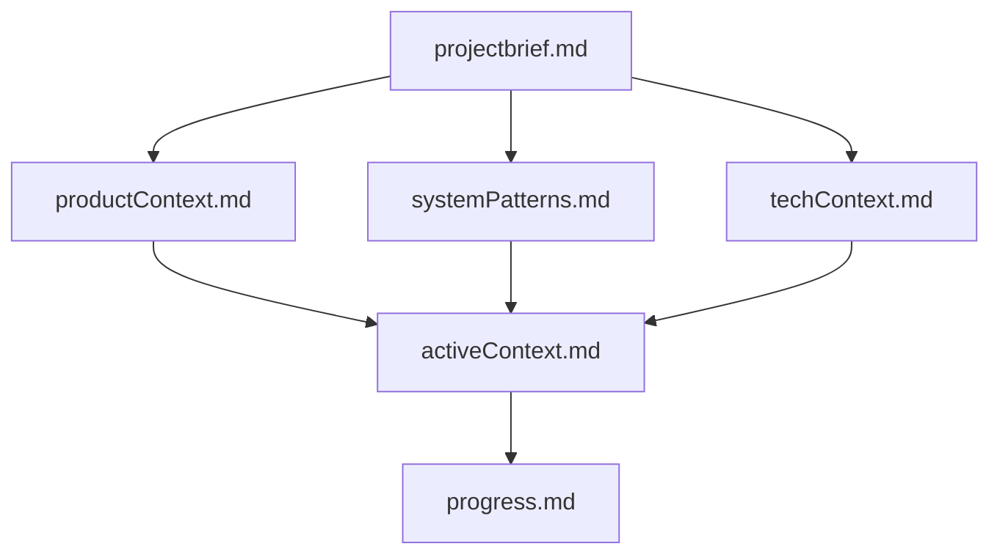

# システムパターン

## ファイル構造
```
.cline/
├── projectbrief.md     # プロジェクトの基本定義
├── productContext.md   # プロジェクトの目的と価値
├── systemPatterns.md   # 本ファイル（システム設計）
├── techContext.md      # 技術スタックと環境
├── activeContext.md    # 現在の作業状況
└── progress.md         # 進捗状況
```

## メモリーバンク更新パターン

### 1. 定期的な更新
- セッション開始時に全ファイルを確認
- 重要な変更後に関連ファイルを更新
- セッション終了時に進捗を記録

### 2. イベントベースの更新
- 新しい技術的決定時
- パターンやベストプラクティスの発見時
- 問題や課題の特定時

### 3. 要求ベースの更新
- ユーザーからの明示的な更新要求時
- コンテキストの明確化が必要な時
- 新しい要件や制約の追加時

## ドキュメント管理の方針

### 1. 文書化基準
- 明確で簡潔な記述
- 実用的な情報の優先
- 階層的な構造化

### 2. 更新ルール
- 変更理由の明記
- 影響範囲の考慮
- 一貫性の維持

### 3. 品質管理
- 定期的なレビュー
- 冗長性の排除
- 最新性の確保

## コンポーネント関係

### 1. メモリーバンクコンポーネント


### 2. 情報フロー
- トップダウン：プロジェクト定義から実装詳細へ
- ボトムアップ：実践からパターン抽出へ
- 双方向：アクティブな作業と進捗の更新

## デザインパターン

### 1. ドキュメント更新パターン
- 変更前の状態確認
- 変更内容の明確化
- 関連ファイルの更新
- 一貫性の検証

### 2. 知識管理パターン
- パターンの抽出
- 再利用可能な形式での記録
- 継続的な改善と更新

### 3. コラボレーションパターン
- 明確なコミュニケーション
- 文脈の共有
- フィードバックの反映
